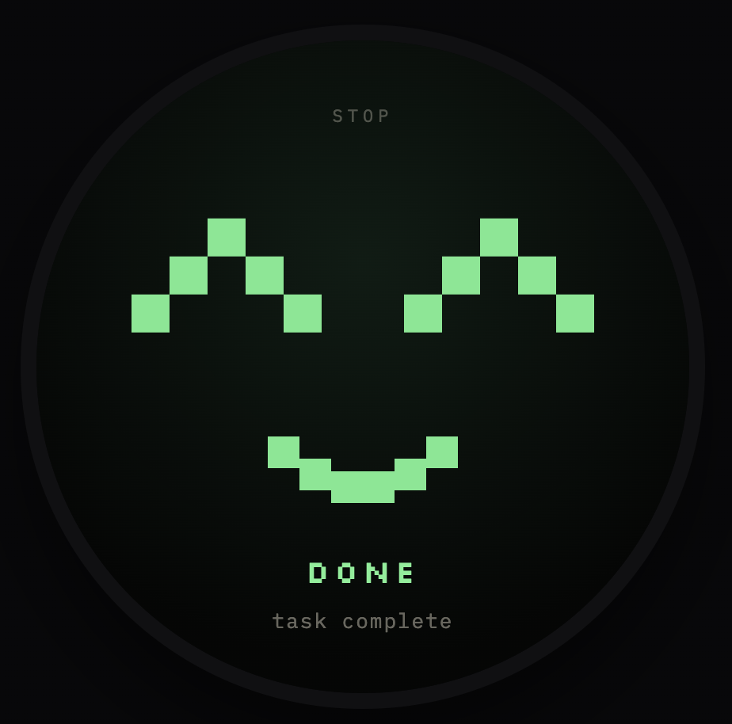
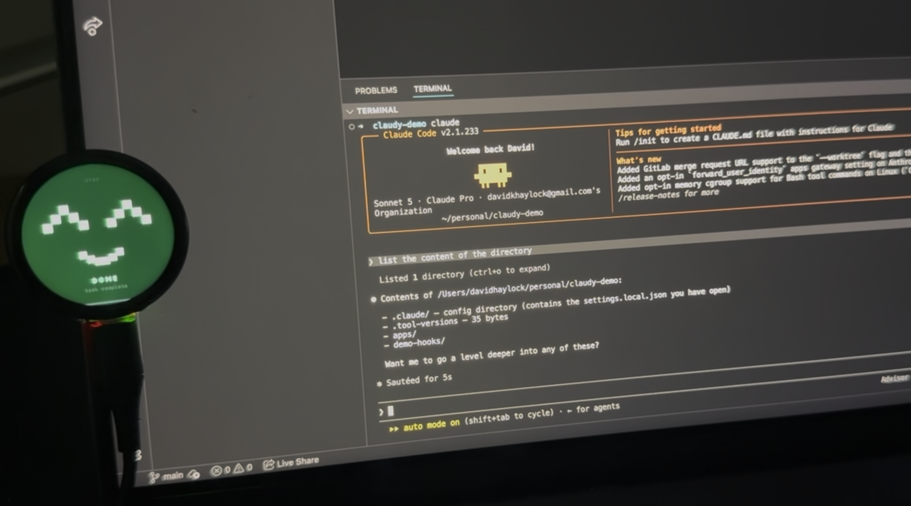
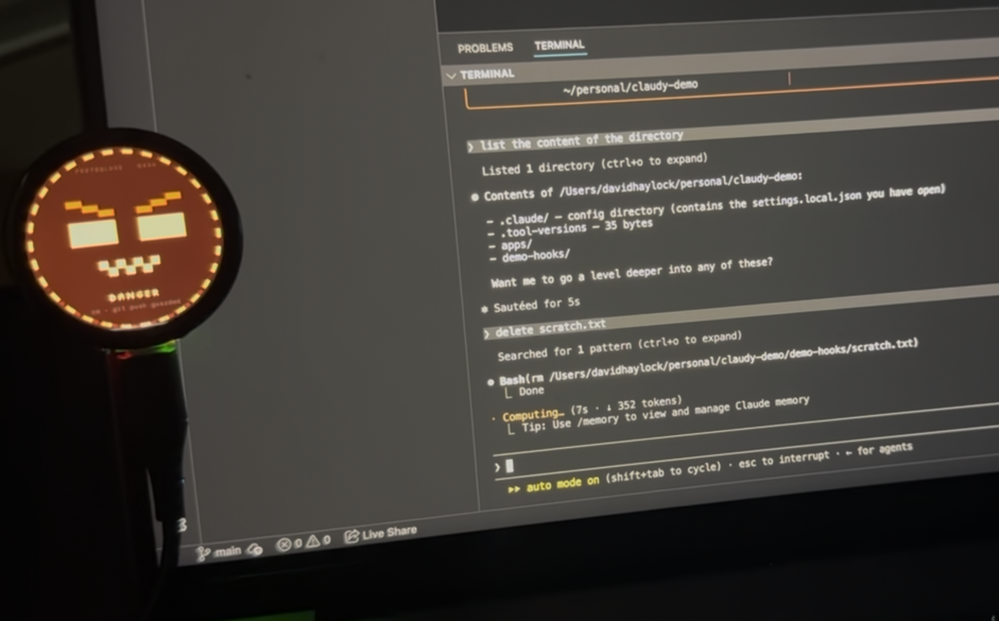

# Claudy



A little round face for your Claude Code sessions. Claudy runs on a
[Waveshare ESP32-S3-Touch-LCD-1.46](https://www.waveshare.com/esp32-s3-touch-lcd-1.46.htm)
board hooked up over USB serial, and shows the current state of your Claude
Code session — waiting on you, running, hit an error, asking permission for
something dangerous, done — so you don't have to keep glancing back at the
terminal to see if it's still working or needs you.

Claude Code hooks fire on session/tool events, a small shell script writes a
one-word command to the board's serial port, and the firmware swaps the face.

| Event | Face |
|---|---|
| Session starts | `start` |
| Waiting on a permission prompt | `attention` |
| Idle / your turn | `idle` |
| Session ends normally | `done` |
| A tool call fails | `fail` |
| About to run something risky (`rm`, `git push`) | `danger` |
| Rate limited / overloaded | `ratelimit` |
| A subagent finishes | `subagent` |
| Session ends | `end` |

## Repo layout

```
apps/
  arduino/src/         Firmware — LVGL UI, display/touch/I2C drivers, faces
  claude/              Hook script + settings.json to copy into a project's .claude/
  lv_port_pc_vscode/   Desktop LVGL simulator (SDL2) for iterating on the UI without a board
designs/               Standalone HTML preview of the faces (no board needed)
```

## Preview the faces without hardware

Open `designs/claudyfaces.html` in a browser to see all the face states
before you flash anything.

## Run the PC simulator

`apps/lv_port_pc_vscode` is an SDL2-based desktop build of the LVGL UI. The
upstream template just shows the stock `lv_demo_widgets()` screen — this repo
wires the actual Claude faces (`apps/arduino/src/Claudy`) in as the demo
screen instead, and cycles through every state automatically, so you can
iterate on faces/layout without flashing a board.

```bash
make run   # setup + build + launch ./apps/lv_port_pc_vscode/bin/main
```

`make run` (see the `Makefile`) does everything needed to go from a clean
checkout to a running demo:

- **`make deps`** — installs `sdl2`, `cmake`, `make` (Homebrew on macOS; see
  `apps/lv_port_pc_vscode/README.md` for Linux/Windows).
- **`make link-faces`** — the face sources (`claude_face_v2*`) and the bitmap
  fonts they need live in `apps/arduino/src/Claudy` (the Arduino sketch dir,
  which has to stay flat for the Arduino IDE and can't be added to the
  simulator's CMake build directly). This symlinks just the files the
  simulator needs into `apps/lv_port_pc_vscode/src/faces/`.
- **`make patch-sim`** — applies `patches/lv_port_pc_vscode.patch` to
  `apps/lv_port_pc_vscode`, a checkout of the
  [upstream LVGL PC simulator template](https://github.com/lvgl/lv_port_pc_vscode).
  Idempotent — it's a no-op if the patch is already applied, and it errors out
  (rather than silently corrupting the tree) if upstream has changed enough
  that the patch no longer applies cleanly.
- **`make configure`** / **`make build`** — runs `cmake` and compiles.

Re-run `make run` (or just `make setup`) any time `apps/lv_port_pc_vscode`
gets reset from upstream — `link-faces` and `patch-sim` are both safe to
repeat. The patch makes three changes to that checkout, to make the faces
demo build and run correctly:

- **`apps/lv_port_pc_vscode/src/main.c`** — calls `claude_face_create(NULL)`
  and `claude_face_cycle(true)` instead of `lv_demo_widgets()`, and sizes the
  SDL window to `CF_DISPLAY_SIZE` (412×412, matching the board's round
  display) instead of the template's 320×480.
- **`apps/lv_port_pc_vscode/CMakeLists.txt`** — globs `src/faces/*.cpp` into
  the build and adds `src/faces` as an include dir, so the symlinked face
  sources compile; also wraps `target_include_directories(lvgl PUBLIC ...)`'s
  app source dir in `$<BUILD_INTERFACE:${PROJECT_SOURCE_DIR}>` instead of
  passing it raw. LVGL's own build does
  `install(TARGETS lvgl EXPORT lvglTargets ...)`, and CMake refuses to export
  a target whose `INTERFACE_INCLUDE_DIRECTORIES` contains a plain path inside
  the source tree — you'll otherwise hit:
  `Target "lvgl" INTERFACE_INCLUDE_DIRECTORIES property contains path ... which is prefixed in the source directory.`
- **`apps/lv_port_pc_vscode/lv_conf.h`** — `LV_USE_THORVG` must be `1`. The
  config ships with `LV_USE_VECTOR_GRAPHIC 1` and `LV_USE_DRAW_SW 1`, but
  `LV_USE_THORVG 0`, and `lv_draw_vector.c` requires
  `LV_USE_DRAW_SW && LV_USE_THORVG` (or another vector backend) — otherwise
  the build fails with `#error "LV_USE_VECTOR_GRAPHIC requires ..."`. The
  CMake build already compiles the bundled ThorVG library by default
  (`CONFIG_LV_USE_THORVG_INTERNAL`), this just wires it up in `lv_conf.h`.

## Hardware setup

1. Buy a [Waveshare ESP32-S3-Touch-LCD-1.46](https://www.waveshare.com/esp32-s3-touch-lcd-1.46.htm).
2. Follow Waveshare's
   [Arduino environment setup guide](https://docs.waveshare.com/ESP32-S3-Touch-LCD-1.46/Development-Environment-Setup-Arduino)
   to install the ESP32 board package in the Arduino IDE.
3. Install **LVGL 8.3.10** via the Arduino Library Manager. This is the only
   external library the firmware needs — the display, touch, and I2C drivers
   (SPD2010, TCA9554PWR) are vendored in `apps/arduino/src/`, not pulled from
   a separate Waveshare demo library.
4. Open `apps/arduino/src/Claudy.ino` in the Arduino IDE, select your board
   and port, and flash it.
5. Plug the board in over USB — that's it, no assembly required. (A 3D-printed
   case is coming soon.)

Once flashed, you can sanity-check it without Claude Code at all: open the
Arduino Serial Monitor at 115200 baud and type any of the state keys above
(`start`, `attention`, `idle`, `done`, `fail`, `danger`, `ratelimit`,
`subagent`, `end`) — the face should change immediately.

## Claude Code setup

Claudy talks to the board via `apps/claude/hooks/send_face_command.sh`, which
writes a state key to the board's serial port
(`/dev/cu.usbmodem*` by default — pass `-p` to override).

Copy the hook script and hook config into a project's `.claude/` directory:

```
mkdir -p .claude/hooks
cp apps/claude/hooks/send_face_command.sh .claude/hooks/
chmod +x .claude/hooks/send_face_command.sh
cp apps/claude/settings.json .claude/settings.json   # or merge into an existing settings.json
```

This wires up the hooks shown in the table above. All hook commands are
`async: true`, so a slow or disconnected board never blocks the agent loop.

You can also install the hook script and `settings.json` under your
user-level Claude Code config instead of per-project, if you want the face to
track every project rather than just one.

## Working




## License

TBD.
